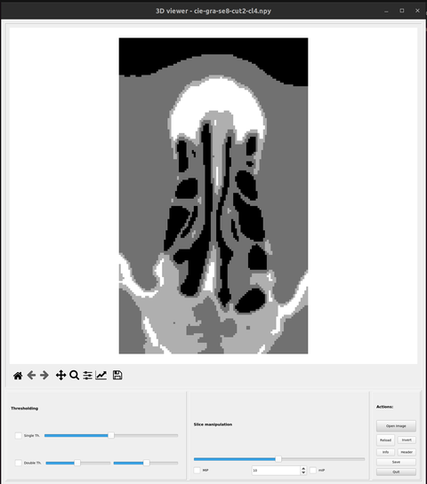

# Computer-aided analysis of paranasal sinus in CT images

<table align="center">
  <tr><td></td></tr>
  <tr><td align="center"><i>Selected slice from 3D image</i></td></tr>
</table>

The aim of the project was to design and implement algorithms to quantify paranasal sinuses in CT images.

The medview3d.py program is a Qt-based 3D visualization tool designed for computer-aided analysis of paranasal sinuses in CT images. Here are its main functionalities:

1. **Loading 3D images**:
   - Support for NIFTI (.nii, .nii.gz), NumPy (.npy), and MATLAB (.mat) formats
   - Ability to load images from command line or through the graphical interface

2. **Displaying image slices**:
   - Visualization of single 2D slices from a 3D image
   - Navigation between slices using a slider
   - Ability to scroll through slices using the mouse wheel

3. **Intensity projections**:
   - MIP (Maximum Intensity Projection)
   - mIP (Minimum Intensity Projection)
   - Adjustment of projection range (number of slices)

4. **Thresholding operations**:
   - Single Threshold - values above threshold are set to maximum, below to minimum
   - Double Threshold - values outside the range are set to boundary values

5. **Image manipulation**:
   - Image inversion (reversing pixel values)
   - Restoring the original image (Reload)

6. **Image information**:
   - Displaying basic information about the image (min, max, mean, data type)
   - Displaying NIFTI file header (if available)

7. **Saving images**:
   - Ability to save processed images in NIFTI, NumPy, or MATLAB formats
   - Preservation of metadata from the original NIFTI file

8. **User interface**:
   - Matplotlib toolbar for view manipulation (zoom in, zoom out, pan)
   - Division of interface into image display area and control panel
   - Control panel divided into sections: thresholding, slice navigation, and actions

9. **High-resolution support**:
   - Support for high-resolution (HiDPI) screens
   - Increased font and interface element sizes

10. **Modular structure**:
    - Code division into modules responsible for different functionalities
    - MPL class for image handling and visualization
    - Separate classes for individual interface elements

The program is designed for analyzing nasal-maxillary septum images, but can be used to view any 3D images in supported formats.

Project between Lodz University of Technology, Lodz, Poland and University of Warmia and Mazury in Olsztyn, Olszytn, Poland.
